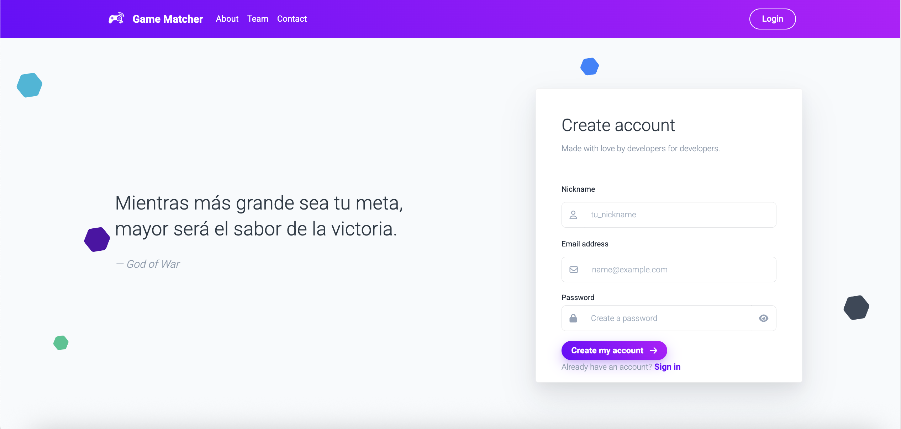
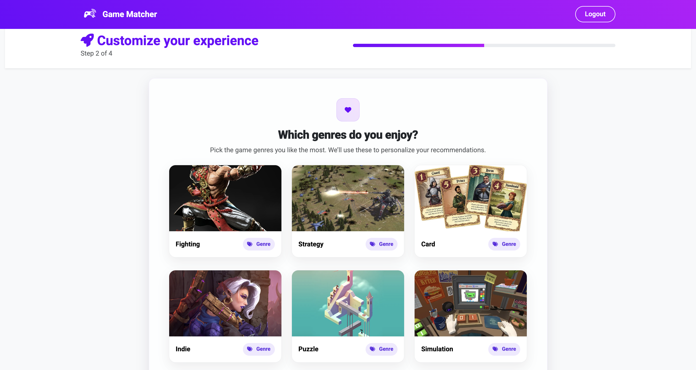
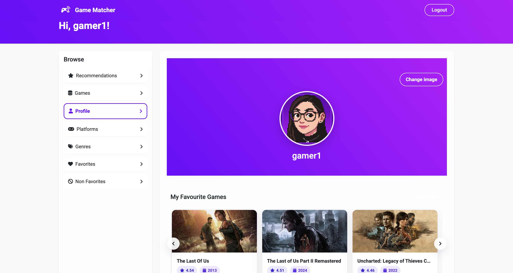
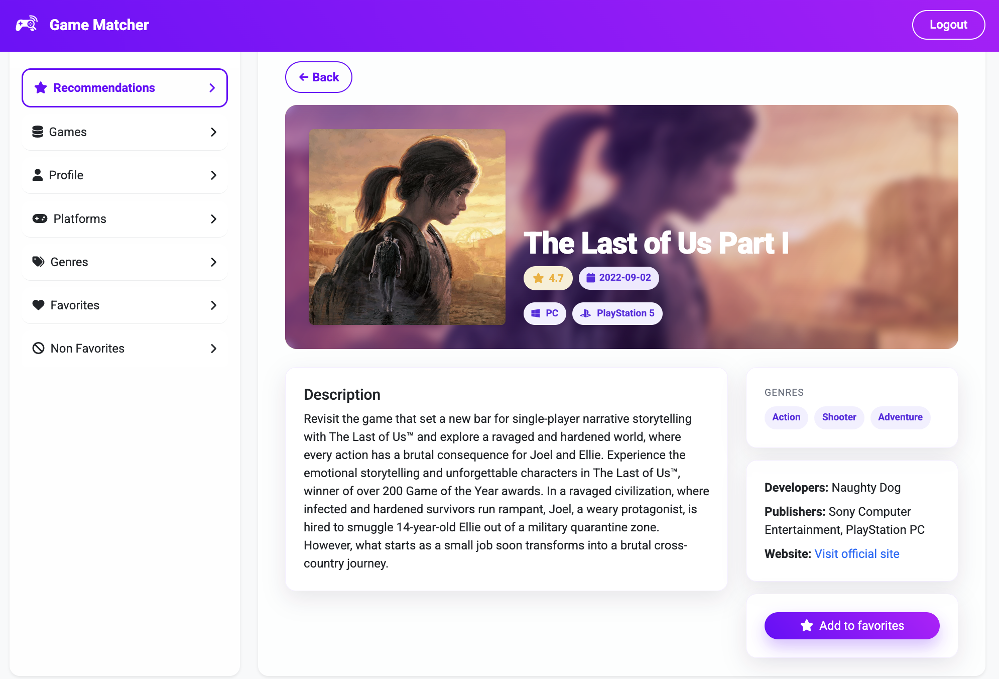

# 🎮 Game Matcher  

**Game Matcher** es una aplicación web que recomienda videojuegos según tus preferencias de género y plataformas.  
Conecta a jugadores con títulos personalizados, integrando **autenticación, perfiles de usuario, y selección de favoritos/no favoritos** para mejorar las sugerencias.  

---

## 🚀 Tecnologías  

### 🔹 Front-End  
- React (Vite) ⚛️  
- JavaScript (ES6+) 💻  
- HTML5 🏷️  
- CSS3 🎨  
- Bootstrap  

### 🔹 Back-End  
- Python 🐍  
- Flask 🌐  
- APIs RESTful  
- JWT Authentication 🔑  

### 🔹 Bases de Datos  
- PostgreSQL 🗃️  
- MySQL   

### 🔹 DevOps & Otros  
- Git / GitHub 🕑  
- Render ☁️  
- Cloudinary (gestión de imágenes de perfil)  

---

## ✨ Funcionalidades  

- 🔐 **Registro y Login con JWT** (usuarios y administradores).  
- 👤 **Perfiles de usuario** con imagen (subida propia o sugerida desde RAWG API).  
- 🎮 **Sistema de recomendaciones personalizadas** según géneros y plataformas.  
- ⭐ **Favoritos / No favoritos** para refinar resultados.  
- 🛠️ **Panel Admin** para gestionar datos (usuarios, juegos, géneros, plataformas).  
- 🔄 **Integración con API de RAWG** para obtener información de videojuegos.  

---

## 📸 Screenshots  

### 🔑 Login / Registro  
  

### 🧩 Onboarding - Preferencias  
  

### 👤 Perfil de Usuario  
  

### ⭐ Recomendaciones  
  

---

## 📂 Estructura del Proyecto  

- /frontend
- /src
- /components
- /pages
- /context
- routes.jsx

- /backend
- /src
- app.py
- models.py
- routes.py
- utils.py
- /migrations

---

## ⚡ Instalación  

### 1️⃣ Clonar repositorio  

git clone https://github.com/Nanceap/game-matcher.git

### 2️⃣ Backend (Flask)

- cd backend
- pipenv install
- pipenv run start

### 3️⃣ Frontend (React)

- cd frontend
- npm install
- npm run dev

---

## 👩🏻‍💻 Autores

- Nancy Acevedo – Full-Stack Developer [LinkedIn](https://www.linkedin.com/in/nancy-acevedo-pietri-b047b9233/)
- Marcel Reig - Full-Stack Developer [LinkedIn](https://www.linkedin.com/in/marcel-reig/)
- Xavier Guas - Full-Stack Developer [LinkedIn](https://www.linkedin.com/in/xavierguas/)
